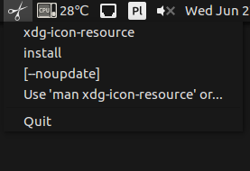

# Clipboard Indicator

[](https://travis-ci.org/dawidd6/indicator-clipboard)



### Installing from PPA

```sh
sudo add-apt-repository ppa:dawidd0811/indicators
sudo apt-get update
sudo apt-get install indicator-clipboard
```

### Building from source

```sh
sudo apt install cmake qtbase5-dev libnotify-dev
cmake .
make
sudo make install
```
